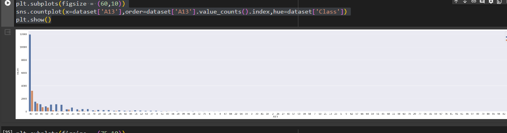
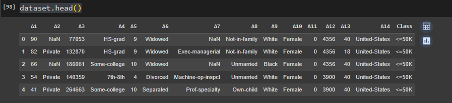
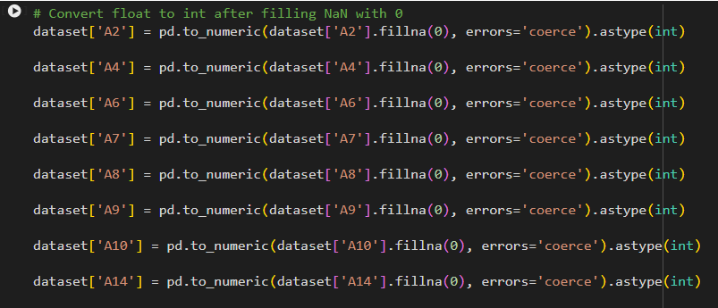
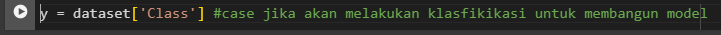
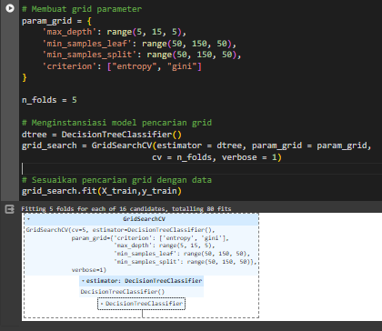
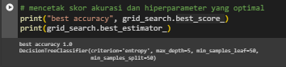

> **Introduction**

Dalam praktikum ini, tujuan utama dari Data Scientist di Google Colab
adalah untuk menerapkan teknik klasifikasi menggunakan pohon keputusan
untuk memprediksi pendapatan masyarakat. Pendekatan ini melibatkan
penggunaan berbagai atribut seperti usia, kategori kelas pekerja, status
pernikahan, jenis kelamin, dan ras untuk mengidentifikasi pola yang
terkait dengan pendapatan kurang dari atau sama dengan 50.000 USD atau
lebih besar dari 50.000 USD.

Langkah pertama dalam mengembangkan model ini adalah membersihkan dan
menyiapkan data untuk dianalisis. Sebuah pohon keputusan kemudian
dibangun dengan menggunakan hiperparameter default. Proses selanjutnya
termasuk memahami dan mengeksplorasi hyperparameter yang dapat disetel
dalam pohon keputusan, serta memilih hyperparameter yang optimal dengan
menggunakan teknik validasi silang pencarian grid.

Tujuan utama dari pendekatan Data Science dalam konteks ini ada dua.
Pertama, identifikasi variabel-variabel kunci yang memiliki pengaruh
signifikan terhadap pendapatan masyarakat. Kedua, terciptanya model
prediksi yang akurat yang dapat memberikan wawasan berharga bagi bank.
Dengan model yang solid, diharapkan dapat memberikan informasi untuk
membantu bank dalam mengoptimalkan pendapatan masyarakat.

Dataset yang digunakan dalam kerja magang ini dapat diakses melalui
tautan berikut:

[[https://drive.google.com/file/d/1x3eL_wKasCr0ROVU5CyTRUGwCvIkR_3Q/view?usp=drive\_]{.underline}](https://colab.research.google.com/corgiredirector?site=https%3A%2F%2Fdrive.google.com%2Ffile%2Fd%2F1x3eL_wKasCr0ROVU5CyTRUGwCvIkR_3Q%2Fview%3Fusp%3Ddrive_link)
[[link]{.underline}](https://colab.research.google.com/corgiredirector?site=https%3A%2F%2Fdrive.google.com%2Ffile%2Fd%2F1x3eL_wKasCr0ROVU5CyTRUGwCvIkR_3Q%2Fview%3Fusp%3Ddrive_link)

Dataset ini berperan penting dalam menggambarkan dan menggeneralisasi
model yang relevan yang membantu membuat prediksi tentang pendapatan
masyarakat.

Untuk mengidentifikasi hal-hal tersebut diatas akan digunakan Bahasa
Pemograman Phyton pada fasilitas yang tersedia pada google colab
(https://colab.research.google.com/).

Untuk masuk ke google colab :

{width="6.5in" height="3.8874989063867016in"}

{width="3.468610017497813in"
height="3.738888888888889in"}Dan secara otomatis pada google drive
(https://drive.google.com/) muncul 1 folder baru : Colab Notebooks,
folder ini dapat dipergunakan untuk meyimpan file script program,
dataset dan file lainnya yang mendukung dalam proses identifikasi yang
akan dilakukan.

{width="6.5in" height="3.6506944444444445in"}

> **Mengumpulkan** **Data**

Sebelum melakukan proses investigasi terhadap permasalahan yang ada,
langkah awal yang dapat dilakukan adalah melakukan pegumpulan data
sesuai dengan permasalahan dan tujuan yang akan dicapai. Proses
pengumpulan data dapat dilakukan dengan cara :

1\. Wawancara 2. Observasi

3\. Angket (Kuisioner) / Survey 4. Studi Dokumen

Sesuai pada bagian Introduction diatas, sumber data akan diperoleh dari
:

[[https://drive.google.com/file/d/1x3eL_wKasCr0ROVU5CyTRUGwCvIkR_3Q/view?usp=drive\_]{.underline}](https://colab.research.google.com/corgiredirector?site=https%3A%2F%2Fdrive.google.com%2Ffile%2Fd%2F1x3eL_wKasCr0ROVU5CyTRUGwCvIkR_3Q%2Fview%3Fusp%3Ddrive_link)
[[link]{.underline}](https://colab.research.google.com/corgiredirector?site=https%3A%2F%2Fdrive.google.com%2Ffile%2Fd%2F1x3eL_wKasCr0ROVU5CyTRUGwCvIkR_3Q%2Fview%3Fusp%3Ddrive_link)

Proses load data dilakukan dengan cara :

> 1\. Download dataset sesuai link diatas :
>
> 2\. Pindahkan dataset tersebut ke folder Colab Notebooks pada akun
> google drive yang telah terkoneksi dengan Google Colab sebelumnya.

{width="6.5in"
height="1.4222222222222223in"}{width="6.239583333333333in"
height="5.4375in"}

> 3\. Untuk melakukan proses import data dari file dataset yang telah
> ada di dalam folder Colab Notebooks tersebut, dapat digunakan perintah
> berikut :
>
> Setelah ke 6 perintah tersebut diatas dijalankan pastikan status
> google drive telah Mounted (Mounted at /content/drive)
>
> 4\. Sekarang, kita dapat memuat data dari file CSV di Google Drive
> dengan menggunakan kode berikut:

{width="6.5in" height="0.5013877952755905in"}

> {width="6.5in"
> height="1.7638888888888888in"}5. Mari kita lihat beberapa baris
> pertama dari dataset untuk memastikan data sudah dimuat dengan benar.

Dataset yang disediakan terdiri dari 32,561 baris dan 15 kolom. Setiap
baris mewakili entri data yang mencakup berbagai informasi, sedangkan
setiap kolom mencerminkan atribut atau fitur tertentu. Berikut adalah
beberapa contoh data dari beberapa kolom:

> **Contoh** **Baris** **Pertama:** • Umur (age): 90
>
> • Kelas Pekerja (workclass): ? • Fnlwgt: 77053
>
> • Pendidikan (education): HS-grad • Pendidikan (education.num): 9
>
> • Status Perkawinan (marital.status): Widowed • Pekerjaan
> (occupation): ?
>
> • Hubungan (relationship): Not-in-family • Ras (race): White
>
> • Jenis Kelamin (sex): Female • Capital Gain: 0
>
> • Capital Loss: 4356
>
> • Jam Kerja per Minggu (hours.per.week): 40 • NegaraAsal
> (native.country): United-States • Kategori Penghasilan (income):
> \<=50K
>
> **Contoh** **Baris** **Terakhir:** • Umur (age): 22
>
> • Kelas Pekerja (workclass): Private • Fnlwgt: 201490
>
> • Pendidikan (education): HS-grad • Pendidikan (education.num): 9
>
> • Status Perkawinan (marital.status): Never-married • Pekerjaan
> (occupation): Adm-clerical
>
> • Hubungan (relationship): Own-child • Ras (race): White
>
> • Jenis Kelamin (sex): Male • Capital Gain: 0
>
> • Capital Loss: 0
>
> • Jam Kerja per Minggu (hours.per.week): 20 • NegaraAsal
> (native.country): United-States • Kategori Penghasilan (income):
> \<=50K

Dataset ini mencakup berbagai informasi demografis dan pekerjaan, serta
kategori penghasilan sebagai target variabel. Harap diperhatikan bahwa
beberapa kolom seperti \"Occupation\" dan \"Native Country\" memiliki
nilai yang tidak diketahui (?).

> 6\. Dengan memberi label ulang tersebut, setiap kolom sekarang
> memiliki nama yang lebih singkat dan dapat diidentifikasi dengan
> mudah. Berikut adalah keterangan singkat untuk setiap kolom baru:
>
> A1: Umur (age)
>
> A2: Kelas Pekerja (workclass) A3: Fnlwgt
>
> A4: Pendidikan (education)
>
> A5: Jumlah Tahun Pendidikan (education.num) A6: Status Perkawinan
> (marital.status)
>
> A7: Pekerjaan (occupation) A8: Hubungan (relationship) A9: Ras (race)
>
> A10: Jenis Kelamin (sex) A11: Capital Gain
>
> A12: Capital Loss
>
> A13: Jam Kerja per Minggu (hours.per.week) A14: NegaraAsal
> (native.country)
>
> {width="6.5in"
> height="0.9041666666666667in"}Class: Kategori Penghasilan (income)
>
> **Menelaah** **Data**
>
> 1\. Analisis karakteristik data pada dataset menggunakan metode info()
> memberikan pemahaman awal yang sangat berharga tentang struktur dan
> kualitas data. Berikut adalah beberapa aspek penting yang dapat
> diambil dari hasil dataset.info():
>
> Jumlah Data:
>
> • Dataset ini terdiri dari 32,561 entri, mencakup sejumlah besar
> informasi yang dapat digunakan untuk analisis.
>
> Jumlah Kolom:
>
> • Terdapat 15 kolom dalam dataset, masing-masing merepresentasikan
> berbagai atribut atau fitur.
>
> Nama Kolom dan Tipe Data:
>
> • Setiap kolom memiliki nama unik dan tipe data tertentu. Misalnya,
> kolom \"A1\" memiliki tipe data integer (int64).
>
> Jumlah Nilai Non-Null:
>
> • Informasi ini menunjukkan bahwa tidak ada nilai null pada dataset
> untuk setiap kolom. Semua kolom memiliki 32,561 nilai non-null,
> menandakan integritas data yang baik.
>
> Tipe Data:
>
> {width="3.2604166666666665in"
> height="3.46875in"}• Tipe data yang beragam mencerminkan keberagaman
> informasi dalam dataset, mulai dari variabel kategoris hingga variabel
> numerik.
>
> {width="6.5in"
> height="2.8499989063867015in"}2. Dalam kode ini, kita mengidentifikasi
> kolom-kolom kategoris dengan mengamati tipe data objek dan jumlah
> level unik kurang dari atau sama dengan 50. Setiap kolom kategoris
> yang terdeteksi kemudian dicetak bersama dengan nilai-nilai uniknya
> untuk memahami lebih lanjut karakteristiknya.
>
> Analisis Kolom Kategoris: **A2** **(Kelas** **Pekerja):**
>
> • \"Nilai unik: \[\'?\' \'Private\' \'State-gov\' \'Federal-gov\'
> \'Self-emp-not-inc\' \'Self-emp-inc\' \'Local-gov\' \'Without-pay\'
> \'Never-worked\'\]\"
>
> • \"Temuan: Terdapat nilai \'?\' yang menunjukkan data yang tidak
> diketahui atau hilang.\"
>
> **A4** **(Pendidikan):**
>
> • \"Nilai unik: \[\'HS-grad\' \'Some-college\' \... \'Preschool\'\]\"
>
> • \"Temuan: Tidak terlihat masalah, nilai unik mencakup berbagai
> tingkat pendidikan.\"
>
> **A6** **(Status** **Perkawinan):**
>
> • \"Nilai unik: \[\'Widowed\' \'Divorced\' \...
> \'Married-AF-spouse\'\]\" • \"Temuan: Data status perkawinan tampak
> lengkap.\"
>
> **A7** **(Pekerjaan):**
>
> • \"Nilai unik: \[\'?\' \'Exec-managerial\' \...
> \'Priv-house-serv\'\]\"
>
> • \"Temuan: Terdapat nilai \'?\' yang menunjukkan data yang tidak
> diketahui atau hilang.\"
>
> **A8** **(Hubungan):**
>
> • \"Nilai unik: \[\'Not-in-family\' \'Unmarried\' \... \'Wife\'\]\"
>
> • \"Temuan: Data hubungan keluarga tampak lengkap.\" **A9** **(Ras):**
>
> • \"Nilai unik: \[\'White\' \'Black\' \'Asian-Pac-Islander\' \'Other\'
> \'Amer-Indian-Eskimo\'\]\" • \"Temuan: Data ras tampak lengkap.\"
>
> **A10** **(Jenis** **Kelamin):**
>
> • \"Nilai unik: \[\'Female\' \'Male\'\]\"
>
> • \"Temuan: Data jenis kelamin tampak lengkap.\" **A14** **(Negara**
> **Asal):**
>
> •      \"Nilai unik: \[\'United-States\' \'?\' \'Mexico\' \...
> \'Outlying-US(Guam-USVI-etc)\'\]\" •      \"Temuan: Terdapat nilai
> \'?\' yang menunjukkan data yang tidak diketahui atau
>
> hilang.\"
>
> **Class** **(Kategori** **Penghasilan):**
>
> • \"Nilai unik: \[\'\<=50K\' \'\>50K\'\]\"
>
> • \"Temuan: Kategori penghasilan tampak lengkap.\" **Temuan**
> **Umum:**
>
> • Beberapa kolom mengandung nilai \'?\' yang menandakan keberadaan
> data yang tidak diketahui atau hilang. Perlu dipertimbangkan apakah
> nilai ini akan diatasi atau dihapus selama pemrosesan data
> selanjutnya.
>
> 3\. Dengan menggunakan perintah dataset\[\'Class\'\].value_counts(),
> kita dapat melihat distribusi kelas pada kolom \'Class\'.
>
> {width="3.3333333333333335in"
> height="0.875in"}\"Hasilnya menunjukkan bahwa terdapat dua kelas:
> \'\<=50K\' dengan jumlah 24,720 entri dan \'\>50K\' dengan jumlah
> 7,841 entri.\"
>
> {width="2.1041666666666665in"
> height="0.6979166666666666in"}4. Temuan: Kelas sudah ditemukan dan
> distribusinya dapat memberikan pemahaman awal tentang proporsi kelas
> dalam dataset.
>
> 5\. Temuan: Kelas seimbang (balanced) **Visualisasi** **Distribusi**
> **Kelas:**
>
> • Menggunakan **sns.set(font_scale=1.4)**, kita setel skala font untuk
> visualisasi. • Dengan memanfaatkan
> **dataset\[\'Class\'\].value_counts().plot(kind=\'bar\',**
>
> **figsize=(7,** **6),** **rot=0)**, kita buat diagram batang untuk
> menampilkan distribusi kelas.
>
> • Akses Label dan Judul: **plt.xlabel(\"Class\",** **labelpad=14)**,
> **plt.ylabel(\"Jumlah\",** **labelpad=14)**, dan
> **plt.title(\"Pendapatan\",** **y=1.02)**.
>
> • Visualisasi ini memberikan gambaran langsung tentang jumlah entri
> untuk setiap kelas (\'\<=50K\' dan \'\>50K\').
>
> **Temuan:**
>
> {width="4.552083333333333in"
> height="4.40625in"}Berdasarkan visualisasi, terlihat bahwa distribusi
> kelas pada kolom \'Class\' cenderung seimbang (balanced), di mana
> jumlah entri untuk setiap kelas tidak memiliki perbedaan yang
> signifikan.
>
> 6\. Visualisasi Distribusi Kelas berdasarkan Usia:
>
> • Menggunakan plt.subplots(figsize=(35, 5)), kita setel ukuran plot
> untuk visualisasi yang lebih baik.\"
>
> • Dengan sns.countplot(x=dataset\[\'A1\'\],
> order=dataset\[\'A1\'\].value_counts().index,
> hue=dataset\[\'Class\'\]), kita buat count plot untuk distribusi kelas
> berdasarkan usia.
>
> • Hasilnya ditampilkan menggunakan plt.show(). **Temuan:**
>
> Berdasarkan visualisasi, terlihat bahwa sebagian besar usia memiliki
> pendapatan \<=50K.

{width="6.5in" height="1.5701377952755906in"}

> 7\. **Visualisasi** **Distribusi** **Kelas** **berdasarkan** **Kelas**
> **Pekerja:**
>
> • Menggunakan **plt.subplots(figsize=(35,** **5))**, kita setel ukuran
> plot untuk visualisasi yang lebih baik.
>
> • Dengan **sns.countplot(x=dataset\[\'A2\'\],**
> **order=dataset\[\'A2\'\].value_counts().index,**
> **hue=dataset\[\'Class\'\])**, kita buat count plot untuk distribusi
> kelas berdasarkan kelas pekerja.
>
> • Hasilnya ditampilkan menggunakan **plt.show()**. **Catatan**
> **Singkat:**
>
> {width="6.5in"
> height="1.4354166666666666in"}Visualisasi ini memberikan gambaran
> distribusi kelas berdasarkan kelas pekerja dalam dataset.
>
> 8\. **Visualisasi** **Distribusi** **Kelas** **berdasarkan**
> **Pendidikan:**
>
> • Menggunakan **plt.subplots(figsize=(35,** **5))**, kita atur ukuran
> plot untuk visualisasi yang optimal.
>
> • Dengan **sns.countplot(x=dataset\[\'A3\'\],**
> **order=dataset\[\'A3\'\].value_counts().index,**
> **hue=dataset\[\'Class\'\])**, kita buat count plot untuk distribusi
> kelas berdasarkan tingkat pendidikan.
>
> • Hasilnya ditampilkan menggunakan **plt.show()**. **Catatan**
> **Singkat:**
>
> Visualisasi ini memberikan gambaran distribusi kelas berdasarkan
> tingkat pendidikan dalam dataset.

{width="6.5in" height="1.488888888888889in"}

> 9\. **Visualisasi** **Distribusi** **Kelas** **berdasarkan**
> **Tingkat** **Pendidikan:**
>
> • Menggunakan **plt.subplots(figsize=(35,** **5))**, ukuran plot
> disetel agar visualisasi optimal.
>
> • Dengan **sns.countplot(x=dataset\[\'A4\'\],**
> **order=dataset\[\'A4\'\].value_counts().index,**
> **hue=dataset\[\'Class\'\])**, count plot dibuat untuk distribusi
> kelas berdasarkan tingkat pendidikan.
>
> • Hasilnya ditampilkan melalui **plt.show()**. **Catatan**
> **Singkat:**
>
> {width="6.5in"
> height="1.5013888888888889in"}Visualisasi ini memberikan gambaran
> distribusi kelas berdasarkan tingkat pendidikan dalam dataset.
>
> 10\. **Visualisasi** **Kelas** **berdasarkan** **Status**
> **Perkawinan:**
>
> • Menggunakan **plt.subplots(figsize=(15,** **5))** dan
> **sns.countplot(x=dataset\[\'A5\'\],**
> **order=dataset\[\'A5\'\].value_counts().index,**
> **hue=dataset\[\'Class\'\])**, distribusi kelas ditampilkan
> berdasarkan status perkawinan.
>
> • Hasilnya dapat dilihat melalui **plt.show()**. **Temuan:**
>
> • Distribusi kelas berdasarkan status perkawinan terlihat pada
> visualisasi.

{width="6.5in"
height="2.6180555555555554in"}{width="6.5in"
height="1.851388888888889in"}

> 11\. **Visualisasi** **Distribusi** **Kelas** **berdasarkan**
> **Status** **Pernikahan:**
>
> • \"Menggunakan **plt.subplots(figsize=(25,** **5))**, ukuran plot
> disetel untuk visualisasi yang baik.\"
>
> • \"Dengan **sns.countplot(x=dataset\[\'A6\'\],**
> **order=dataset\[\'A6\'\].value_counts().index,**
> **hue=dataset\[\'Class\'\])**, count plot dibuat untuk distribusi
> kelas berdasarkan status pernikahan.\"
>
> • \"Hasilnya ditampilkan melalui **plt.show()**.\" **Temuan:**
>
> • \"Distribusi kelas dapat dilihat berdasarkan status pernikahan pada
> visualisasi ini.\"
>
> 12\. **Visualisasi** **Distribusi** **Kelas** **berdasarkan**
> **Pekerjaan:**
>
> • \"Menggunakan **plt.subplots(figsize=(45,** **10))**, ukuran plot
> disetel agar visualisasi optimal.\"
>
> • \"Dengan **sns.countplot(x=dataset\[\'A7\'\],**
> **order=dataset\[\'A7\'\].value_counts().index,**
> **hue=dataset\[\'Class\'\])**, count plot dibuat untuk distribusi
> kelas berdasarkan pekerjaan.\"
>
> • \"Hasilnya ditampilkan melalui **plt.show()**.\"
>
> **Temuan:**

{width="6.5in"
height="1.9388888888888889in"}{width="6.5in"
height="2.779166666666667in"}

> • \"Distribusi kelas dapat dilihat berdasarkan jenis pekerjaan pada
> visualisasi ini.\"
>
> 13\. **Visualisasi** **Distribusi** **Kelas** **berdasarkan**
> **Hubungan** **Keluarga:**
>
> • \"Menggunakan **plt.subplots(figsize=(15,** **5))**, ukuran plot
> disetel untuk visualisasi yang baik.\"
>
> • \"Dengan **sns.countplot(x=dataset\[\'A8\'\],**
> **order=dataset\[\'A8\'\].value_counts().index,**
> **hue=dataset\[\'Class\'\])**, count plot dibuat untuk distribusi
> kelas berdasarkan hubungan keluarga.\"
>
> • \"Hasilnya ditampilkan melalui **plt.show()**.\" **Temuan:**
>
> • \"Distribusi kelas dapat dilihat berdasarkan hubungan keluarga pada
> visualisasi ini.\"
>
> 14\. **Visualisasi** **Distribusi** **Kelas** **berdasarkan** **Ras:**
>
> • \"Menggunakan **plt.subplots(figsize=(20,** **10))**, ukuran plot
> disetel agar visualisasi optimal.\"
>
> • \"Dengan **sns.countplot(x=dataset\[\'A9\'\],**
> **order=dataset\[\'A9\'\].value_counts().index,**
> **hue=dataset\[\'Class\'\])**, count plot dibuat untuk distribusi
> kelas berdasarkan ras.\"
>
> • \"Hasilnya ditampilkan melalui **plt.show()**.\"

{width="6.5in" height="3.6013888888888888in"}

> **Temuan:**
>
> • \"Distribusi kelas dapat dilihat berdasarkan ras pada visualisasi
> ini.\"
>
> 15\. **Visualisasi** **Distribusi** **Kelas** **berdasarkan**
> **Jenis** **Kelamin:**
>
> • \"Menggunakan **plt.subplots(figsize=(15,** **5))**, ukuran plot
> disetel untuk visualisasi yang baik.\"
>
> •     \"Dengan **sns.countplot(x=dataset\[\'A10\'\],**
> **order=dataset\[\'A10\'\].value_counts().index,**
> **hue=dataset\[\'Class\'\])**, count plot dibuat untuk distribusi
> kelas berdasarkan jenis kelamin.\"
>
> • \"Hasilnya ditampilkan melalui **plt.show()**.\" **Temuan:**
>
> {width="6.5in"
> height="2.7881944444444446in"}• \"Distribusi kelas dapat dilihat
> berdasarkan jenis kelamin pada visualisasi ini.\"

{width="6.5in"
height="0.9805555555555555in"}{width="6.5in"
height="1.3652766841644794in"}

> 16\. **Visualisasi** **Distribusi** **Kelas** **berdasarkan**
> **Keuntungan** **Kapital:**
>
> • \"Menggunakan **plt.subplots(figsize=(100,** **10))**, ukuran plot
> disetel agar visualisasi optimal.\"
>
> • \"Dengan **sns.countplot(x=dataset\[\'A11\'\],**
> **order=dataset\[\'A11\'\].value_counts().index,**
> **hue=dataset\[\'Class\'\])**, count plot dibuat untuk distribusi
> kelas berdasarkan keuntungan kapital.\"
>
> • \"Hasilnya ditampilkan melalui **plt.show()**.\" **Temuan:**
>
> • \"Distribusi kelas dapat dilihat berdasarkan keuntungan kapital pada
> visualisasi ini.\"
>
> 17\. **Visualisasi** **Distribusi** **Kelas** **berdasarkan**
> **Kerugian** **Kapital:**
>
> • \"Menggunakan **plt.subplots(figsize=(75,** **10))**, ukuran plot
> disetel agar visualisasi optimal.\"
>
> • \"Dengan **sns.countplot(x=dataset\[\'A12\'\],**
> **order=dataset\[\'A12\'\].value_counts().index,**
> **hue=dataset\[\'Class\'\])**, count plot dibuat untuk distribusi
> kelas berdasarkan kerugian kapital.\"
>
> • \"Hasilnya ditampilkan melalui **plt.show()**.\" **Temuan:**
>
> • \"Distribusi kelas dapat dilihat berdasarkan kerugian kapital pada
> visualisasi ini.\"
>
> 18\. **Visualisasi** **Distribusi** **Kelas** **berdasarkan** **Jam**
> **Kerja** **per** **Minggu:**
>
> • \"Menggunakan **plt.subplots(figsize=(60,** **10))**, ukuran plot
> disetel agar visualisasi optimal.\"
>
> • \"Dengan **sns.countplot(x=dataset\[\'A13\'\],**
> **order=dataset\[\'A13\'\].value_counts().index,**
> **hue=dataset\[\'Class\'\])**, count plot dibuat untuk distribusi
> kelas berdasarkan jam kerja per minggu.\"
>
> • \"Hasilnya ditampilkan melalui **plt.show()**.\" **Temuan:**

{width="6.5in"
height="1.7145833333333333in"}{width="6.5in"
height="1.359721128608924in"}

> • \"Distribusi kelas dapat dilihat berdasarkan jam kerja per minggu
> pada visualisasi ini.\"
>
> 19\. **Visualisasi** **Distribusi** **Kelas** **berdasarkan**
> **Negara** **Asal:**
>
> • \"Menggunakan **plt.subplots(figsize=(75,** **10))**, ukuran plot
> disetel agar visualisasi optimal.\"
>
> • \"Dengan **sns.countplot(x=dataset\[\'A14\'\],**
> **order=dataset\[\'A14\'\].value_counts().index,**
> **hue=dataset\[\'Class\'\])**, count plot dibuat untuk distribusi
> kelas berdasarkan negara asal.\"
>
> • \"Hasilnya ditampilkan melalui **plt.show()**.\" **Temuan:**
>
> • \"Distribusi kelas dapat dilihat berdasarkan negara asal pada
> visualisasi ini.\"
>
> {width="3.824304461942257in"
> height="2.479861111111111in"}20. **Analisis** **Korelasi** **Tahap**
> **1:** \"Menggunakan **dataset.corr()**, korelasi antar variabel
> dihitung, dan hasilnya divisualisasikan melalui heatmap dengan ukuran
> plot yang disetel sesuai, memberikan gambaran korelasi pada dataset.\"

{width="6.127777777777778in"
height="5.520138888888889in"}

> **Memvalidasi** **Data**
>
> Validasi Data:
>
> • \"Dilakukan pengecekan untuk melihat apakah masih ada data yang
> tersisa atau nilai yang hilang.\"
>
> • \"Kelas terlihat hampir seimbang.\"
>
> • \"Tidak semua variabel muncul karena data masih dalam bentuk objek
> dan belum diklasifikasikan.\"
>
> • \"Selanjutnya, perlu dilakukan transformasi objek menjadi angka dan
> proses menangani data yang hilang.\"
>
> **Menentukan** **Object** **Data**
>
> 1\. Feature yg akan digunakan pada case ini adalah adalah A1-A15 dan
> label target yang digunakan adalah Class. Untuk memberikan keterangan
> keterangan object data dapat digenerate menggunakan table generator
> yang dapat di akses di
> [[https://www.tablesgenerator.com/markdown_tables]{.underline}](https://colab.research.google.com/corgiredirector?site=https%3A%2F%2Fwww.tablesgenerator.com%2Fmarkdown_tables)

{width="5.052083333333333in"
height="3.9895833333333335in"}{width="6.5in"
height="2.9166666666666665in"}

> 2\.
>
> 3\.

{width="6.5in"
height="2.120138888888889in"}{width="6.5in"
height="4.895833333333333in"}

> 4\. Paste pada text di Phyton
>
> **Membersihkan** **Data**

Pada tahap ini, langkah-langkah pembersihan data yang dilakukan
meliputi:

> {width="6.5in"
> height="0.32569444444444445in"}1. Perintah **dataset.replace(\"?\",**
> **np.nan,** **inplace=True)** digunakan untuk mengganti nilai \"?\"
> dengan NaN (Not a Number) pada dataset, membersihkan data dari nilai
> yang tidak diketahui.
>
> {width="6.5in"
> height="1.4930555555555556in"}2. Dapat melihat lima baris pertama dari
> dataset menggunakan perintah **dataset.head()**. Perintah ini
> memberikan tampilan singkat tentang struktur dan nilai-nilai dalam
> dataset.
>
> {width="6.5in"
> height="1.484721128608924in"}3. Perintah **dataset.tail()** digunakan
> untuk menampilkan lima baris terakhir dari dataset, memberikan
> gambaran singkat tentang struktur dan nilai-nilai terakhir dalam
> dataset.
>
> {width="6.5in"
> height="0.7944433508311461in"}4. Data telah berhasil dideteksi dan
> diubah menjadi NaN pada kolom-kolom kategori yang mengandung nilai
> \"?\". Ini merupakan langkah awal dalam membersihkan data dari nilai
> yang tidak valid atau tidak diketahui.

{width="5.75in" height="5.104166666666667in"}

> {width="6.5in"
> height="0.6930555555555555in"}5. Jika hasil eksekusi kode
> **dataset.isnull().values.any()** mengembalikan nilai **True**, itu
> berarti ada setidaknya satu nilai yang hilang (NaN) dalam dataset.
>
> {width="6.5in"
> height="0.5152766841644795in"}6. Kode **dataset.loc\[:,**
> **dataset.isnull().any()\].columns** akan memberikan daftar kolom
> (feature) yang memiliki setidaknya satu nilai yang hilang (NaN) dalam
> dataset.
>
> 7\. **dataset.info()** memberikan informasi rinci tentang dataset,
> termasuk jumlah entri, tipe data, dan apakah ada nilai yang hilang
> dalam setiap kolom.

{width="3.5in" height="3.7083333333333335in"}

> {width="6.5in"
> height="1.033332239720035in"}{width="6.5in"
> height="2.8784722222222223in"}8.
> **missingno.matrix(dataset\[missingdata_df\])** digunakan untuk
> memvisualisasikan pola data yang hilang (missing values) dalam bentuk
> matriks. Matriks tersebut akan menunjukkan di mana letak nilai-nilai
> yang hilang pada setiap kolom dataset.
>
> {width="6.5in"
> height="2.247916666666667in"}9. Kode di bawah mengubah kolom
> kategorikal menjadi numerik dengan menggunakan peta atau kamus. Setiap
> kategori diberikan nilai numerik sesuai dengan kamus yang telah
> ditentukan. Proses ini memungkinkan penggunaan data kategorikal dalam
> model machine learning yang memerlukan input numerik.
>
> {width="3.5in" height="3.8125in"}10. Output
> dari **dataset.info()** memberikan informasi mengenai dataset,
> termasuk tipe data setiap kolom, jumlah nilai non-null, dan penggunaan
> memori. Dengan melihat output tersebut, kita dapat mengetahui struktur
> umum dari dataset, apakah terdapat nilai yang hilang, serta tipe data
> masing-masing kolom.
>
> 11\. Data hilang pada kolom A2, A7, danA14 telah diisi dengan nilai
> median.

{width="5.3125in"
height="2.8020833333333335in"}

> {width="3.78125in"
> height="4.697916666666667in"}12. Tidak ada data yang berjenis objek
> (non-numerik) pada dataset setelah dilakukan pengubahan tipe data dan
> pengisian nilai data yang hilang.

{width="6.5in" height="2.792361111111111in"}

> **Mengkonstruksi** **Data**

Mengkonstruksi data dilakukan dengan mengonversi data yang masih dalam
bentuk objek menjadi tipe data numerik dan memastikan bahwa semua data
telah diperlakukan secara sesuai.

> 1\. Melakukan konversi tipe data float menjadi integer setelah mengisi
> nilai NaN dengan 0.
>
> {width="6.135416666666667in"
> height="4.114583333333333in"}2. Menampilkan dataset setelah dilakukan
> konversi tipe data dan pengisian nilai NaN.
>
> {width="4.0625in"
> height="4.197916666666667in"}3. Menampilkan informasi tentang dataset
> setelah dilakukan konversi tipe data dan pengisian nilai NaN.

Pada tahap ini, dilakukan penghapusan nilai konstan dari dataset.
Langkah ini bertujuan untuk mengeliminasi kolom-kolom yang tidak
memberikan variasi informasi karena hanya memiliki satu nilai unik. Hal
ini dapat mempermudah analisis dan pemodelan data, mengurangi
kompleksitas, dan memastikan fokus pada fitur-fitur yang lebih
informatif. Meskipun langkah ini dapat membantu membersihkan dataset,
tetapi tetap perlu diperhatikan agar informasi yang dihilangkan tidak
krusial untuk analisis lebih lanjut. Sehingga, sebaiknya selalu lakukan
pengecekan sebelum dan sesudah penghapusan untuk memastikan integritas
dan keberlanjutan analisis data.

> {width="6.28125in"
> height="0.3958333333333333in"}4. Pada tahap ini, dilakukan penghapusan
> kolom yang memiliki nilai konstan dalam dataset menggunakan perintah
> **dataset** **=** **dataset.loc\[:,**
> **dataset.apply(pd.Series.nunique)** **!=** **1\]**, bertujuan untuk
> menyederhanakan struktur data dengan fokus pada fitur-fitur yang lebih
> informatif
>
> .
>
> {width="3.1770833333333335in"
> height="3.6875in"}5. Info dataset setelah menghapus nilai konstan
> menunjukkan bahwa sejumlah kolom telah dihapus, dan data telah
> berhasil disederhanakan.
>
> {width="6.5in"
> height="0.7444444444444445in"}6. Temuan: Setelah menghapus nilai
> konstan, jumlah atribut berkurang menjadi 6, menunjukkan bahwa
> sebelumnya terdapat atribut dengan nilai konstan yang telah dihapus.
>
> {width="4.177083333333333in"
> height="2.4479166666666665in"}7. Mengecek korelasi antar variabel
> dengan menggunakan heatmap korelasi.

{width="5.125in"
height="3.5in"}{width="2.2708333333333335in"
height="0.3541666666666667in"}

> {width="6.5in"
> height="0.9423611111111111in"}8. Menganalisis distribusi data
> menggunakan boxplot untuk setiap fitur.

{width="5.666666666666667in"
height="3.9895833333333335in"}{width="2.6458333333333335in"
height="0.3229166666666667in"}

> **Menentukan** **Label** **Data**

Dalam bab ini, langkah-langkah untuk menentukan label data atau jumlah
grup atau cluster dijelaskan. Penentuan ini disesuaikan dengan kasus
yang ada. Jika tujuan utama adalah klasifikasi, langkah pertama adalah
memberi label pada data (dalam hal ini, metode klasifikasi digunakan
karena data sudah memiliki label pada atribut \'Class\'). Namun, jika
tujuan utamanya adalah pengelompokan, langkah pertama adalah
mengidentifikasi jumlah cluster yang optimal dan menetapkan label
kategori untuk setiap cluster. Proses ini memberikan dasar untuk
memahami struktur data dan mempersiapkan langkah-langkah selanjutnya
dalam analisis atau pemodelan data.

> {width="6.5in"
> height="0.31527777777777777in"}1. Kode **y** **=**
> **dataset\[\'Class\'\]** digunakan untuk menyimpan atribut kelas dari
> dataset, menandakan persiapan untuk melakukan klasifikasi atau
> membangun model yang memprediksi atribut kelas (\'Class\').
>
> {width="3.125in"
> height="2.1666666666666665in"}2. Kode **y** digunakan untuk mengecek
> isi variabel **y**, yang merupakan atribut kelas dari dataset, sebagai
> langkah verifikasi.
>
> {width="6.5in"
> height="0.6972211286089239in"}3. Kode ini menentukan jumlah cluster
> (dalam hal ini 2 cluster) dan menggunakan metode KMeans untuk
> melakukan klasterisasi pada dataset. Pastikan library yang dibutuhkan
> untuk klasterisasi telah diimport dan diperiksa pada bab sebelumnya.
>
> 4\. Kode tersebut mendefinisikan objek **km** yang merupakan model
> KMeans dengan jumlah cluster sebanyak 2. Objek ini dapat digunakan
> untuk melakukan proses klasterisasi pada data.

{width="6.5in" height="1.320832239720035in"}

> {width="3.4479166666666665in"
> height="0.5625in"}5. Kode tersebut mengimpor library **pandas** dan
> modul **KMeans** dari library **sklearn.cluster** yang diperlukan
> untuk melakukan klasterisasi menggunakan algoritma KMeans.
>
> {width="3.1041666666666665in"
> height="0.40625in"}6. Kode tersebut membuat list bernama
> **selected_features** yang berisi satu fitur, yaitu \'Class\'. List
> ini kemungkinan akan digunakan untuk memilih fitur-fitur tertentu dari
> dataset.
>
> {width="4.385416666666667in"
> height="0.3541666666666667in"}7. Kode tersebut membuat DataFrame baru
> bernama **features** yang berisi kolom \'Class\' dari dataset. Data
> ini mungkin akan digunakan sebagai fitur dalam proses klasterisasi
> atau pemodelan.
>
> {width="3.6666666666666665in"
> height="0.6354166666666666in"}8. Kode ini menggunakan fungsi
> **get_dummies** dari pandas untuk mengubah variabel kategorikal dalam
> **features** menjadi variabel biner (dummy/indikator). Hal ini
> membantu dalam proses pemodelan atau klasterisasi yang memerlukan
> input numerik.
>
> {width="4.583333333333333in"
> height="0.3645833333333333in"}9. KMeans dengan jumlah klaster
> (clusters) sebanyak 2 dan menggunakan nilai seed (random_state) 42
> untuk memastikan reproduktibilitas hasil.
>
> 10\. Menambahkan kolom \'cluster\' ke dalam dataset dengan menggunakan
> hasil klasterisasi dari KMeans yang telah dilakukan pada fitur yang
> telah dipilih sebelumnya.

{width="6.5in" height="0.3680555555555556in"}

> {width="6.5in"
> height="0.39999890638670166in"}11. Mengganti nilai klaster (0 dan 1)
> dengan label yang lebih deskriptif (\'ditolak\' dan \'diterima\') pada
> kolom \'cluster\'.
>
> {width="2.5625in"
> height="2.374998906386702in"}12. Hasil cetakan dari variabel
> **features** akan menunjukkan data yang telah diubah menjadi
> representasi one-hot encoding setelah penerapan
> **pd.get_dummies(features)**.
>
> 13\. Output dari variabel **dataset** akan menunjukkan kumpulan data
> dengan penambahan kolom baru, yaitu **cluster**, yang mengindikasikan
> hasil dari proses klasterisasi menggunakan algoritma KMeans. Label
> dari klaster tersebut juga telah diubah menjadi \"ditolak\" dan
> \"diterima\".

{width="6.21875in" height="3.71875in"}

> **Membangun** **Model**

Dalam Bab 8 ini, langkah-langkah untuk membangun model akan dijelaskan
dengan detail. Ini termasuk pemilihan algoritma yang sesuai dengan jenis
masalah yang dihadapi, pembagian data menjadi set pelatihan dan
pengujian, dan proses pelatihan model. Setelah model dibangun, evaluasi
kinerja akan dilakukan menggunakan metrik yang relevan, dan model
kemudian dapat disesuaikan atau dioptimalkan sesuai kebutuhan.
Langkah-langkah ini akan memberikan pemahaman yang kuat tentang
bagaimana model diterapkan pada data dan bagaimana kinerjanya dapat
diukur.

Berikut adalah beberapa langkah prapemrosesan data sebelum membangun
model:

Pertama, kita perlu memperhatikan bahwa dataset kita memiliki fitur
kategorikal dan numerik sebagai prediktor. Untuk model-model sebelumnya
seperti regresi linier dan logistik, kita harus membuat variabel boneka
untuk variabel kategorikal karena model-model tersebut hanya dapat
memproses variabel numerik.

Namun, pohon keputusan dapat dengan mudah memproses variabel kategorikal
tanpa perlu membuat variabel boneka. Meskipun demikian, kita masih perlu
mengkodekan variabel kategorikal ke dalam format standar agar sklearn
dapat memahaminya dan membangun pohon keputusan. Kita akan menggunakan
kelas LabelEncoder() dari modul sklearn.preprocessing untuk melakukan
ini.

Berikut adalah langkah-langkah untuk mengkodekan variabel kategorikal
menggunakan LabelEncoder:

> 1\. Dengan menggunakan LabelEncoder, kita dapat mempersiapkan variabel
> kategorikal untuk digunakan dalam membangun model.

{width="5.96875in"
height="2.5729166666666665in"}

> {width="6.291666666666667in"
> height="2.2916666666666665in"}2. Menerapkan encoder Label pada
> variabel kategorikal untuk mengubah nilai-nilai menjadi representasi
> numerik, memungkinkan penggunaan variabel tersebut dalam membangun
> model pohon keputusan.
>
> {width="6.177083333333333in"
> height="2.4791666666666665in"}3. Menggabungkan dataset yang telah
> dikodekan numerik dari variabel kategorikal dengan dataset asli,
> mempersiapkan data untuk pembangunan model pohon keputusan.
>
> {width="2.9479166666666665in"
> height="3.65625in"}4. Output dari dataset.info() menunjukkan informasi
> tentang dataset, termasuk jumlah entri, jenis data, dan jumlah nilai
> non-null untuk setiap kolom, yang penting untuk memastikan keseluruhan
> kualitas dan konsistensi data sebelum membangun model.
>
> {width="6.5in"
> height="0.7347211286089239in"}5. Perubahan tipe data pada kolom-kolom
> tertentu ke tipe data kategorikal dapat membantu memastikan bahwa
> variabel yang sesuai dengan kategori atau label tidak dianggap sebagai
> variabel numerik, yang mungkin menyebabkan kesalahan dalam
> interpretasi dan pemrosesan model.
>
> Pada tahap ini, saya memulai proses pembangunan model dengan membuat
> pohon keputusan menggunakan hiperparameter default. Langkah ini
> memberikan kita gambaran awal tentang performa model tanpa penyetelan
> tambahan. Selanjutnya, saya akan melibatkan teknik validasi silang
> untuk menyetel hiperparameter pohon keputusan agar sesuai dengan data
> pelatihan saya. Proses ini membantu meningkatkan kinerja model dan
> mengoptimalkan keakuratannya. Evaluasi model dilakukan dengan mengukur
> sejumlah metrik kinerja yang relevan, memungkinkan kita untuk memahami
> sejauh mana model kita berhasil dalam memprediksi target kelas pada
> dataset yang diberikan. Hasil evaluasi ini menjadi dasar untuk
> pengambilan keputusan lebih lanjut terkait peningkatan model dan
> pengoptimalkan parameter.
>
> {width="5.177083333333333in"
> height="0.40625in"}6. Gunakan library **train_test_split** dari
> scikit-learn untuk membagi dataset menjadi dua bagian, yaitu data
> pelatihan (training) dan data uji (testing), memungkinkan kita untuk
> mengevaluasi kinerja model pada data yang tidak pernah dilihat selama
> proses pelatihan.
>
> {width="6.5in"
> height="0.6756944444444445in"}7. Memisahkan dataset menjadi variabel
> fitur (X) dan variabel target (y) dengan cara menghilangkan
> kolom-kolom yang tidak diperlukan dari dataset. Variabel fitur (X)
> akan berisi atribut-atribut yang digunakan untuk membuat prediksi,
> sedangkan variabel target (y) akan berisi label atau nilai yang ingin
> diprediksi.
>
> {width="6.5in"
> height="2.6041666666666665in"}8. Memisahkan data menjadi data latih
> dan data uji menggunakan fungsi **train_test_split** dari
> scikit-learn. Data latih (X_train, y_train) digunakan untuk melatih
> model, sedangkan data uji (X_test, y_test) digunakan untuk menguji
> performa model.
>
> 9\. Mengimpor pengklasifikasi pohon keputusan dari pustaka
> scikit-learn dan memasang pohon keputusan dengan hyperparameter
> default, kecuali **max_depth** yang diatur menjadi 5 agar dapat
> melakukan plotting dan pembacaan pohon.

{width="5.260416666666667in"
height="1.6979166666666667in"}{width="4.53125in"
height="1.09375in"}

> {width="6.5in"
> height="2.1756944444444444in"}10. Mari kita periksa metrik evaluasi
> dari model default kita. Pertama, kita mengimpor laporan klasifikasi
> dan matriks kebingungan dari metrik scikit-learn. Selanjutnya, kita
> membuat prediksi menggunakan model default dan mencetak laporan
> klasifikasi.
>
> 11\. Mencetak matriks kekeliruan dan akurasi dari model default:
>
> 12\. Mengimpor package yang diperlukan untuk visualisasi dan
> menempatkan fitur:

{width="4.625in" height="3.71875in"}

> 13\. Visualisasi pohon keputusan telah dibuat menggunakan model
> default dengan kedalaman maksimum 5, menampilkan fitur dan struktur
> keputusan secara grafis.

{width="6.5in" height="4.745137795275591in"}

> {width="5.40625in"
> height="3.0416666666666665in"}14. Visualisasi pohon keputusan dengan
> kedalaman maksimum 3 telah dibuat, memperjelas struktur dan keputusan
> yang diambil oleh model.
>
> {width="5.479166666666667in"
> height="4.9375in"}15. Kita menggunakan GridSearchCV untuk menemukan
> kedalaman maksimum yang optimal untuk pohon keputusan. Kedalaman yang
> terbaik akan digunakan untuk membangun model akhir.
>
> {width="6.5in"
> height="1.0756933508311461in"}16. Hasil dari GridSearchCV, termasuk
> skor validasi silang (CV scores) untuk setiap nilai kedalaman pohon
> yang diuji. Skor CV dapat membantu kita memilih kedalaman pohon yang
> optimal.
>
> 17\. Grafik menunjukkan hubungan antara nilai **max_depth** dengan
> waktu pelatihan dan akurasi pengujian pada model pohon keputusan,
> membantu pemilihan nilai hiperparameter yang optimal.

{width="5.9375in" height="4.5in"}

> 18\. Skor CV GridSearch untuk kedalaman maksimal menunjukkan hubungan
> antara jumlah minimal sampel di daun dan akurasi pengujian, membantu
> menentukan nilai hiperparameter optimal untuk model pohon keputusan.

{width="4.072916666666667in"
height="3.9270833333333335in"}

> {width="6.5in"
> height="1.019443350831146in"}19. Berikut adalah beberapa nilai skor
> yang dihasilkan dari GridSearchCV, yang mencakup parameter
> min_samples_leaf dan hasil pengujian yang relevan, membantu dalam
> mengevaluasi dan memilih hiperparameter yang optimal untuk membangun
> model pohon keputusan.
>
> 20\. Berikut adalah grafik yang mencerminkan akurasi dan waktu
> pelatihan dengan variasi nilai min_samples_leaf pada model pohon
> keputusan. Grafik ini membantu dalam mengevaluasi kinerja model dengan
> mengamati dampak perubahan hiperparameter tertentu terhadap akurasi
> dan waktu pelatihan.

{width="5.958333333333333in"
height="4.510416666666667in"}

> 21\. Setelah menjalankan GridSearchCV dengan variasi nilai
> min_samples_split pada model pohon keputusan, kami dapat mengevaluasi
> kinerja model dengan melihat grafik akurasi dan waktu pelatihan untuk
> setiap nilai min_samples_split. Grafik ini memberikan pandangan yang
> lebih komprehensif tentang bagaimana model bereaksi terhadap perubahan
> hiperparameter ini.

{width="4.083333333333333in" height="3.875in"}

> {width="6.5in"
> height="0.9819444444444444in"}22. Data frame di atas menunjukkan skor
> Cross-Validation untuk setiap kombinasi nilai min_samples_split yang
> diuji dalam GridSearchCV, termasuk parameter seperti waktu pelatihan
> dan skor uji rata-rata. Dengan menganalisis data frame ini, kita dapat
> memilih nilai min_samples_split yang optimal untuk meningkatkan
> kinerja model pohon keputusan.
>
> 23\. Grafik di bawah menunjukkan hubungan antara waktu pelatihan dan
> akurasi uji rata-rata terhadap nilai min_samples_split yang diuji
> dalam GridSearchCV.Analisis grafik ini dapat membantu kita memilih
> nilai min_samples_split yang optimal untuk memperbaiki kinerja model
> pohon keputusan.

{width="5.895833333333333in"
height="4.53125in"}

> 24\. GridSearchCV digunakan untuk mencari kombinasi hyperparameter
> yang optimal dalam model Decision Tree. Parameter yang diuji
> melibatkan kedalaman maksimal pohon (**max_depth**), jumlah minimum
> sampel di daun (**min_samples_leaf**), jumlah minimum sampel yang
> diperlukan untuk membagi simpul internal (**min_samples_split**), dan
> kriteria pemilihan fitur terbaik (**criterion**). Proses ini membantu
> menentukan kombinasi hyperparameter yang memberikan kinerja terbaik
> pada data pelatihan dan meminimalkan risiko overfitting atau
> underfitting.

{width="4.375in" height="3.7916666666666665in"}

> {width="6.5in"
> height="1.6597222222222223in"}25. DataFrame **cv_results** menyajikan
> hasil dari GridSearchCV yang mencakup kombinasi hyperparameter yang
> diuji beserta skor akurasi dan informasi lainnya pada setiap lipatan
> cross-validation. Data ini membantu untuk memahami bagaimana performa
> model Decision Tree bervariasi dengan setiap kombinasi hyperparameter
> yang diuji, memandu pemilihan hyperparameter yang optimal untuk model.
>
> {width="3.6875in"
> height="0.8645833333333334in"}26. Print ini menunjukkan skor akurasi
> terbaik yang ditemukan oleh GridSearchCV dan kombinasi hyperparameter
> yang memberikan skor tersebut. Informasi ini berguna untuk memahami
> kinerja model yang dihasilkan dengan hyperparameter yang dioptimalkan.
>
> {width="3.7291666666666665in"
> height="1.5520833333333333in"}27. Langkah ini melibatkan pembuatan
> model dengan hyperparameter yang dioptimalkan. Pohon keputusan
> diinisialisasi dengan hyperparameter terbaik yang ditemukan oleh
> GridSearchCV, dan kemudian dipasangkan pada data pelatihan. Model yang
> dihasilkan dengan hyperparameter yang dioptimalkan ini dapat digunakan
> untuk melakukan prediksi pada data uji.
>
> {width="3.25in"
> height="0.8854166666666666in"}28. Akurasi dari model pohon keputusan
> yang telah dibangun dengan hyperparameter optimal adalah nilai yang
> diperoleh pada data uji. Dalam hal ini, Anda dapat melihat nilai
> akurasi pada dataset uji dengan menjalankan perintah
> **clf_gini.score(X_test,** **y_test)**.
>
> {width="5.947916666666667in"
> height="2.374998906386702in"}29. Dengan menggunakan pohon keputusan
> yang memiliki kedalaman maksimal (max_depth) sebesar 3, kita dapat
> melihat akurasi model pada data uji.
>
> 30\. Berikut adalah visualisasi dari pohon keputusan yang telah
> dibangun dengan menggunakan hyperparameter optimal. Pohon ini
> memperlihatkan struktur keputusan

{width="6.5in" height="2.4076377952755905in"}

> yang digunakan oleh model untuk mengklasifikasikan data.
>
> {width="6.34375in"
> height="2.1145833333333335in"}31. Pada model pohon keputusan dengan
> hyperparameter optimal, kita mendapatkan hasil metrik klasifikasi
> seperti yang dicetak oleh fungsi **classification_report** pada data
> uji.
>
> {width="3.78125in"
> height="1.0520833333333333in"}32. Matriks kebingungan (confusion
> matrix) menggambarkan hasil klasifikasi pada model pohon keputusan
> dengan hyperparameter optimal terhadap data uji.
